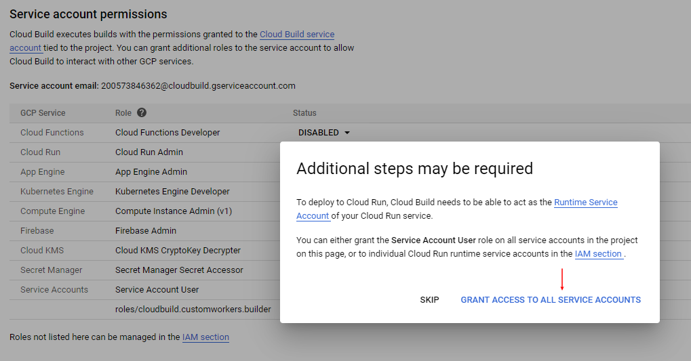
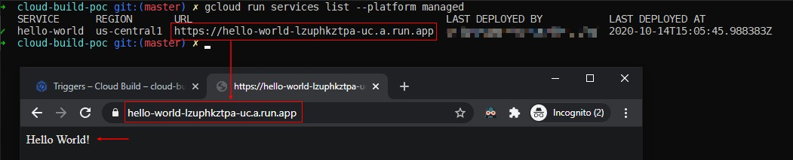

# Getting Started with Cloud Build

## Table of contents

<!-- MarkdownTOC autolink="true" -->

- [Prerequisites](#prerequisites)
- [Preparing the environment](#preparing-the-environment)
- [Creating a Sample App](#creating-a-sample-app)
- [Creating Cloud Build Triggers](#creating-cloud-build-triggers)
- [Setting Permissions](#setting-permissions)
- [Testing the trigger](#testing-the-trigger)

<!-- /MarkdownTOC -->

## Prerequisites

- Git
- Terraform
- Google Cloud SDK (Gcloud) 

## Preparing the environment

1. Clone this repo:

```bash
git clone https://github.com/cronos2810/cloud-build-poc
cd cloud-build-poc/project-creation
```

2. Create the GCP Project using Terraform

```bash
# Initialize Terraform
terraform init

# Generate the Build Plan
terraform plan -var-file 00-terraform.tfvars

# Apply
terraform apply -var-file 00-terraform.tfvars -auto-approve

# Save the Project ID for later use
PROJECT_ID=$(terraform output | grep -o "cloud-build-poc-......")

# Prepare the GCLOUD Environment
gcloud config set project ${PROJECT_ID}
```

## Creating a Sample App

We are going to be using the files from this repository to create a sample app, you can check the code in the following files:

- app/Dockerfile
- app/main.py

```bash
# Change the directory
cd ../app

# Build the Docker Hello World Image with Cloud Build using the PROJECT_ID variable created before
gcloud builds submit --tag gcr.io/${PROJECT_ID}/helloworld

# Once the image gets created, make the deploy in cloud run
gcloud run deploy hello-world \
  --image gcr.io/${PROJECT_ID}/helloworld \
  --platform managed \
  --allow-unauthenticated
```

We can test the app navigating to the URL displayed after using the command `gcloud run services list --platform managed`

Congratulations! We've successfully deployed a Cloud Run App using Cloud Build, next we are going to be learning how to use triggers to automatically deploy new versions of the Application using Cloud Build as CI/CD tool. 

## Creating Cloud Build Triggers

Now we are going to be creating a push trigger using gcloud and environment variables for customization: 

```bash
# Setting our PROJECT_ID in the cloudbuild.yaml file
sed -i "s/PROJECT_ID/$PROJECT_ID/" cloudbuild.yaml

# Setting variables for the trigger
export NAME="my-github-trigger"
export REPO_OWNER="cronos2810"
export REPO_NAME="cloud-build-poc"
export BUILD_CONFIG="app/cloudbuild.yaml"

# Creating the trigger using the gcloud and the master branch
gcloud beta builds triggers create github \
  --name=${NAME} \
  --repo-owner=${REPO_OWNER} \
  --repo-name=${REPO_NAME} \
  --branch-pattern="^master$" \
  --build-config=${BUILD_CONFIG}
```

## Setting Permissions

We need to setup some permissions before testing:

1. Set to "ENABLED" the following permissions on Cloud Build Settings, click on "Grant access to all service accounts" when Prompted, you can change this setting later if needed.

```text
Cloud Run           Cloud Run Admin
Service Accounts    Service Account User
```



## Testing the trigger

Now we've created and configured a trigger that will build our image and deploy the new version of the app every time that we do a "push" to the Github repository, lets test! 

`gcloud run services list --platform managed`



- Lets make a change to our app:

```bash
# Making the change
sed -i "s/World/W0rld\!\!\!\!/" main.py

# Add, commit and push
git add .
git commit -m "Changed World -> W0rld\!\!\!\! in main.py"
git push origin master
```

